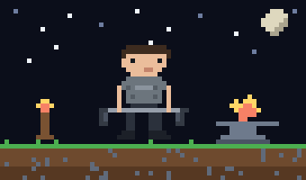
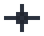
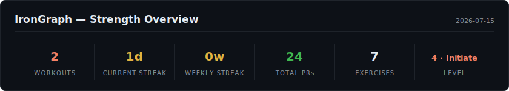
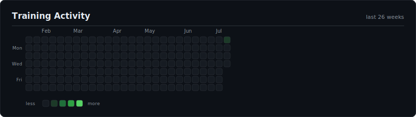
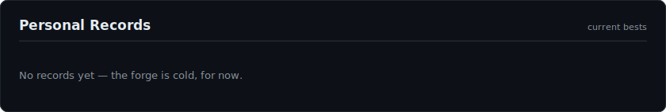
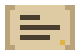
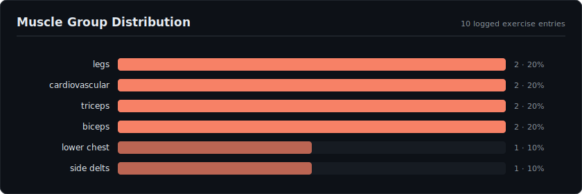
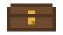
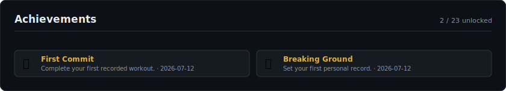

# ⚒️ IronGraph

### Software evolves through commits. Strength does too.

**Every green square tells a story. Some represent code I wrote. Others represent strength I earned.**

 

Every night, GitHub opens a new quest.
Every completed workout becomes structured history.
Every personal record becomes a milestone.
Every commit represents real progress in the physical world —
authored by the person who performed it.

---

**⚔️ Level 2 · Novice** — 310 XP

&nbsp;&nbsp;&nbsp;

❤️ quests this week (0/3) · ✦ progress to level 3

The hero's armor is forged by training: cloth → leather → steel → gilded → ember.
Every workout commit is XP. Every PR re-lights the forge.

##  PR Vault

Every record below was once impossible.

##  Quest Log

| Date | Session | Highlights |
|---|---|---|
| 2026-07-12 | cardio | Incline Treadmill 1.5 mi |

## 🫀 Attribute Distribution

##  Trophy Hall

##  The Forge — Contribution Philosophy

| Software | Strength |
|---|---|
| Issues | Daily workout quests |
| Commits | Completed training sessions |
| Version history | Physical progression |
| Releases | Major personal-record milestones |
| Dependency graph | The exercise knowledge graph |
| Contribution graph | Code **and** real-world training, side by side |

> You write code to improve software. You train to improve yourself.
> **IronGraph gives both forms of progress a version history.**

**How it works:** at 9 PM (America/Phoenix) a GitHub Action opens a quest
issue. I tap **Log today's workout** — a form pre-listing every exercise I
track — type numbers next to what I trained, and Submit (or just comment
`Exercise: numbers` on the quest and close it). A workflow parses and validates the data, updates records,
achievements and charts, and creates **one atomic Git commit authored as
`Ashish Kurse <ashishkurse@gmail.com>`** on the default branch — so when
GitHub's [documented contribution criteria](https://docs.github.com/en/account-and-profile/setting-up-and-managing-your-github-profile/managing-contribution-settings-on-your-profile/why-are-my-contributions-not-showing-up-on-my-profile)
are satisfied, a workout can appear on my contribution graph exactly like
code. GitHub Actions is only the scribe; the author of the workout is me.

No claim is made that every automated commit is guaranteed a green
square — attribution ultimately follows GitHub's own rules. IronGraph's
job is to make each workout commit *eligible*: real repository, default
branch, my verified email as author.

---

## 🛠️ Under the Hood

- **[Architecture](docs/architecture.md)** — how an issue becomes a commit
- **[Setup guide](docs/setup.md)** — run your own IronGraph
- **[Data schemas](docs/data-schema.md)** — everything is auditable JSON
- **[Contribution attribution](docs/contribution-attribution.md)** — why the author is a human, not a bot
- **[Local dashboard](docs/dashboard.md)** — the Obsidian-like exercise graph (`make dev`)
- **[AI integration](docs/ai.md)** — optional Gemini-powered coach

Built with IronGraph — <b>Build strength. Commit progress.</b>
Training data is personal history, not medical advice.

README generated 2026-07-15 from 1 recorded workouts. Data lives in <code>data/</code>; every number is recomputable.
