

# ⚒️ IronGraph

### Software evolves through commits. Strength does too.

**Every green square tells a story. Some represent code I wrote. Others represent strength I earned.**

 

<samp>
night falls&nbsp;&nbsp;·&nbsp;&nbsp;the forge lights&nbsp;&nbsp;·&nbsp;&nbsp;a quest opens 
one plain-text line becomes structured history 
a new best becomes a milestone, forever 
and the hero on the anvil below gets a little more built — 
one trained muscle at a time
</samp>

 

<a href="#physique">Physique</a> ·
<a href="#overview">Overview</a> ·
<a href="#pr-vault">PR Vault</a> ·
<a href="#quest-log">Quest Log</a> ·
<a href="#progression">Progression</a> ·
<a href="#muscles">Muscles</a> ·
<a href="#trophies">Trophies</a> ·
<a href="#philosophy">How it works</a>

---

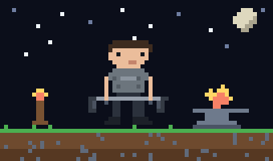

**⚔️ Level 4 · Initiate** — 2155 XP

&nbsp;&nbsp;&nbsp;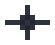

❤️ quests this week (1/3) · ✦ progress to level 5

Gear is forged by consistency: cloth → leather → steel → gilded → ember, one tier per milestone level.
Physique is forged by specificity — see below. Every workout commit is XP; every PR re-lights the forge.

## 💪 Physique — the hero is built by what you train

No two lifters look the same, and neither do their heroes. Every region below grows **independently**, in real pixels, on the sprite above — skip leg day and the hero's legs will, visibly, know.

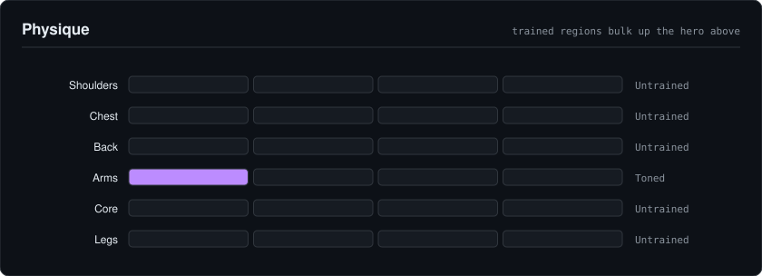

**Arms** is furthest along right now — just getting started.

## 📈 Strength Overview

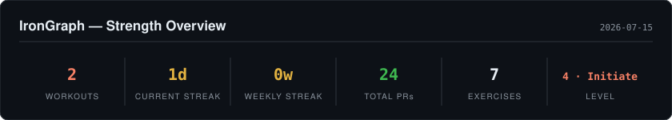

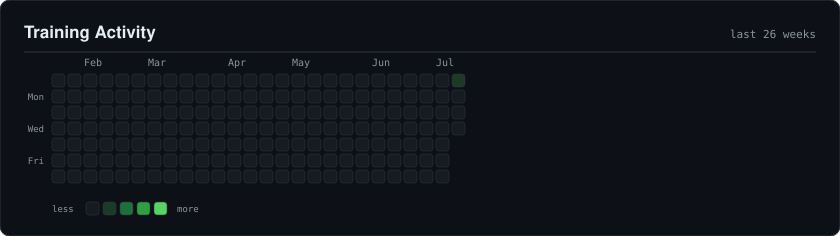

##  PR Vault

Every record below was once impossible.

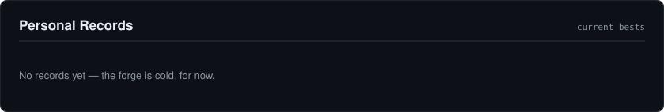

## 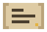 Quest Log

| Date | Session | Highlights |
|---|---|---|
| 2026-07-15 | chest + shoulders + biceps | Dips 70 lb × 3, Lateral Raise 35 lb × 4, Dumbbell Curl 35 lb × 3 +4 more |
| 2026-07-12 | cardio | Incline Treadmill 1.5 mi |

## 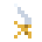 Strength Progression

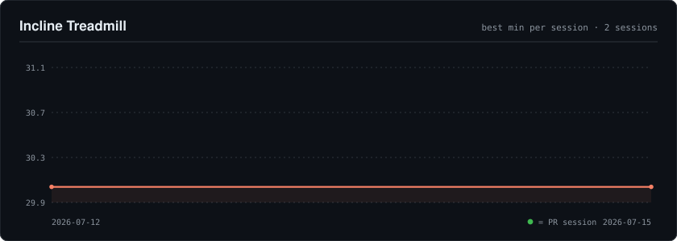

## 🫀 Attribute Distribution

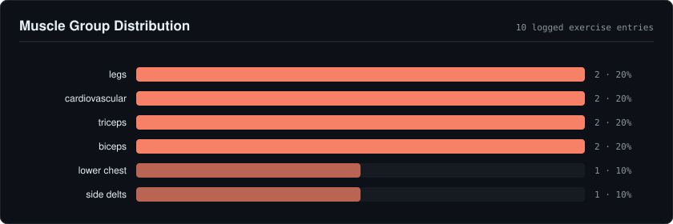

## 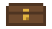 Trophy Hall

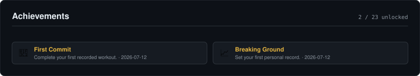

##  The Forge — Contribution Philosophy

| Software | Strength |
|---|---|
| Issues | Daily workout quests |
| Commits | Completed training sessions |
| Version history | Physical progression |
| Releases | Major personal-record milestones |
| Dependency graph | The exercise knowledge graph |
| Contribution graph | Code **and** real-world training, side by side |

> You write code to improve software. You train to improve yourself.
> **IronGraph gives both forms of progress a version history.**

**How it works:** at 9 PM (America/Phoenix) a GitHub Action opens a quest
issue — a blank prompt, nothing pre-filled, nothing to pick from. I edit
the issue (or just comment) with what I did, in my own words, and close
it. A workflow matches each exercise name — exactly, then fuzzily, typos
and all — against everything I've ever trained; a name that still
doesn't match becomes a brand-new exercise on the spot. It parses and
validates the numbers, updates records, achievements, charts, and **the
hero's physique** (see above), and creates **one atomic Git commit
authored as `Ashish Kurse <ashishkurse@gmail.com>`** on the default
branch — so when GitHub's
[documented contribution criteria](https://docs.github.com/en/account-and-profile/setting-up-and-managing-your-github-profile/managing-contribution-settings-on-your-profile/why-are-my-contributions-not-showing-up-on-my-profile)
are satisfied, a workout can appear on my contribution graph exactly like
code. GitHub Actions is only the scribe; the author of the workout — and
of the strength — is me.

Why fuzzy matching, and why the hero has a physique at all

 

Two design choices that aren't obvious from the diagrams above:

- **Matching is deliberately conservative.** A typo like "Deadlft" finds
  "Deadlift" instantly, but a bare, ambiguous word like "Press" or
  "Squat" is *never* auto-matched to one variant over another — ties
  between two genuinely different exercises are left unresolved, so a
  new exercise is created instead of silently crediting the wrong lift.
  Better an extra graph node than a corrupted PR history.
- **The hero's regions grow independently**, driven by how often *that
  region specifically* has been trained — not overall level. A
  deadlift-only lifter and a bench-only lifter end up visibly different
  at the same level, because they are.

No claim is made that every automated commit is guaranteed a green
square — attribution ultimately follows GitHub's own rules. IronGraph's
job is to make each workout commit *eligible*: real repository, default
branch, my verified email as author.

---

## 🛠️ Under the Hood

- **[Architecture](docs/architecture.md)** — how an issue becomes a commit
- **[Setup guide](docs/setup.md)** — run your own IronGraph
- **[Data schemas](docs/data-schema.md)** — everything is auditable JSON
- **[Contribution attribution](docs/contribution-attribution.md)** — why the author is a human, not a bot
- **[Local dashboard](docs/dashboard.md)** — the Obsidian-like exercise graph (`make dev`)
- **[AI integration](docs/ai.md)** — optional Gemini-powered coach

Built with IronGraph — <b>Build strength. Commit progress.</b>
Training data is personal history, not medical advice.

README generated 2026-07-26 from 2 recorded workouts. Data lives in <code>data/</code>; every number is recomputable.
